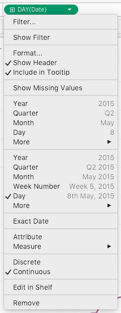
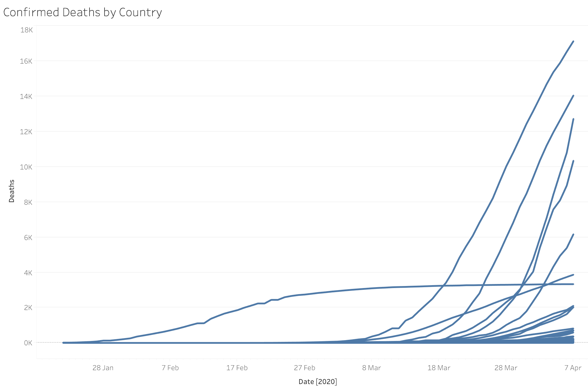
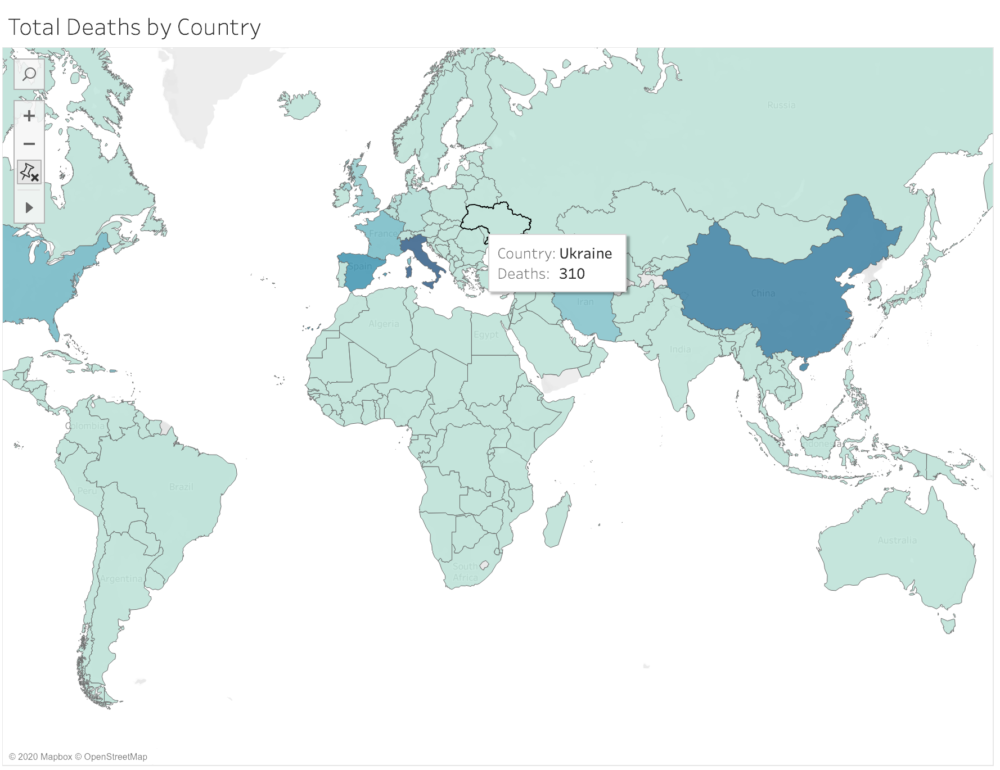

## Using the MongoDB Dataset from Tableau

Tableau is a powerful data visualisation and dashboard tool,
and can be connected to our COVID-19 data in a few short steps.

When you first create a new document in Tableau, you can choose to use 'MongoDB BI Connector' as your data source.
We've enabled the Atlas MongoDB BI Connector for you, so you can use tools like Tableau which expect a relational database as a data source.
The MongoDB BI Connector exposes a MySQL interface to the MongoDB database.

To connect Tableau to the `covid19` database, select "MongoDB BI Connector" in the "Connect" panel.

If you haven't used this data source type before, you'll find it by clicking the "More..." button.
In this case you may also need to install an ODBC provider (I needed to install iODBC on my Mac, for example) and the MySQL ODBC connector from Oracle. You'll find instructions to install these by following the link on the connection dialog.

Once you have the necessary components installed,  fill in the form as follows:

The details are:

- Server: covid-19-biconnector.hip2i.mongodb.net
- Port: 27015
- Database: covid19
- Username: readonly
- Password: readonly

Once you have connected to the data source, you'll see various tables listed on the left-hand side. Unfortunately, because Tableau works with tables instead of MongoDB's rich documents, we have to flatten the documents into tables which can be rejoined within Tableau.

It's most likely you'll be interested in the data in the "global_and_us" table, which contains the number of coronavirus statistics for each country (or in the case of the USA, by individual city).

## Charting Trends With Time

To start with a simple chart, I'll describe how to build a line chart of confirmed deaths by country. Either use the default sheet, or click the "New Worksheet" button at the bottom of the screen.

From the left-hand column, drag 'Date' to the Columns box at the top of the window. Click on the arrow inside the lozenge, and select 'Day' from the context menu.

Now drag 'Confirmed' from the 'Measures' box on the left to the 'Rows' box at the top of the window. Finally, drag 'Country' from the 'Measures' box to the 'Marks' box just to the right of the 'Measures' box. You should see a line chart with a bunch of blue lines. If you click on the three coloured circles next to where you just dropped 'Country', it will color each line differently by country, which makes it a little easier to read.

## Showing Statistics on a Map

Let's chart the same statistic on a World map. Create a new worksheet by clicking the "New Worksheet" button at the bottom of the screen. 

Drag 'Longitude (generated)' to 'Columns', 'Latitude (generated)' to 'Rows', and both 'Country' and 'Confirmed' to the 'Marks' box.  Click on the icon next to 'SUM(Confirmed)' (the last item you dropped on the screen) and select 'Color'.

The end result should look like this:

